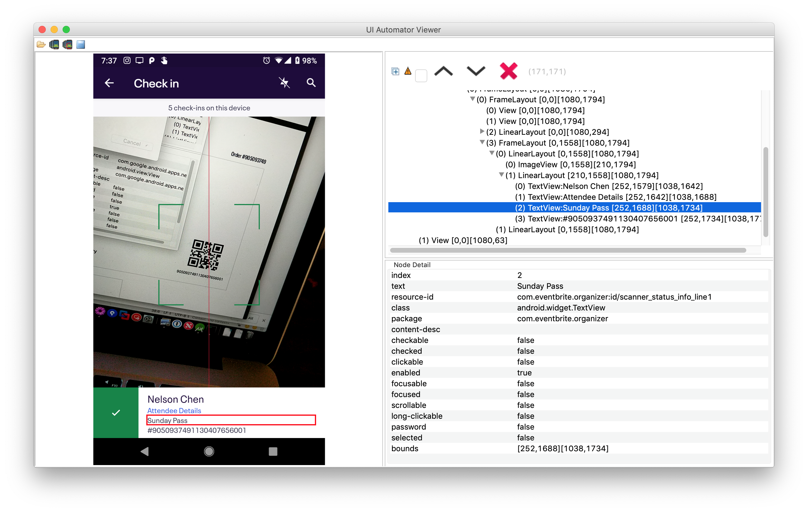

# PassShout

*Currently only works with [EventBrite Organizer][eborg].*

This **Android** App speaks the Ticket Type or Pass Type of attendees checking in with
the [Eventbrite Organizer app][eborg].

Instead of having to squint at the tiny text saying the *Ticket Type* or *Pass
Type*, this App will read it out loud after scanning.

In the image below, the phone will say "**Sunday Pass**" right after the
Eventbrite success chime.

# Usage

* Download/Install the APK from [GitHub Releases][gh-releases].
  * You may need to allow apps from non-Play Store sources. Please use Google
   or use [Amazon's instructions that they wrote for their own App Store][amazon-nps-install].
* Open the App. It'll take you to a Settings page to enable the *PassShout*
  service.
* Enable the *PassShout* service.
* Scan an **unchecked-in** ticket/pass in in the *Eventbrite Organizer*.
   * There is a "debounce" mechanism to prevent saying the same pass type twice
      for every unique barcode.

## Interesting Usage

* The App will request audio focus and pause playback of "background audio" temporarily. This can be 
  music or a PSA telling guests to get their tickets out on a loop. This functionality was tested 
  with VLC for Android and other music applications. 

## Post-Usage

* Uninstall the App after the event. The App is implemented in a low-power and
  efficient manner but the nature of its implementation means it can stay
  running unless uninstalled.

# History

Written *after* [Socal Retro Gaming Expo 2019][socalretro] which has ticket
types of:

* Saturday Pass
* Weekend Pass
* Sunday Pass
* Kid Pass
  * Not scanned in

Saturdays are always the most hectic. And some attendees bought a Weekend Pass
for themselves but a Saturday pass for their partner.

[eborg]: https://play.google.com/store/apps/details?id=com.eventbrite.organizer&hl=en_US
[socalretro]: https://www.facebook.com/events/847656285422712/
[gh-releases]: https://github.com/nelsonjchen/PassShout/releases
[amazon-nps-install]: https://www.amazon.com/gp/help/customer/display.html?nodeId=201482620
